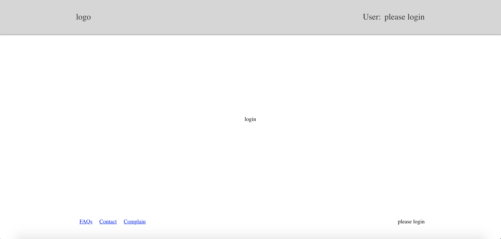

# Redux Lecture

## Common Terms

### Action

An action is a plain object that represents an intention to change the state. Actions are the only way to get data into the store.

### Reducer

A reducer (also called a reducing function) is a function that accepts an accumulation and a value and returns a new accumulation. They are used to reduce a collection of values down to a single value.

### Store

A store is an object that holds the application's state tree.

### Action creators

An action creator is, quite simply, a function that creates an action.

### Dispatch Functions

a function that accepts an action it then dispatches the action to the store.

## Tips

-   you should not mutate the state object, but return a new object if the state changes.

-   Instead of mutating the state directly, you specify the mutations you want to happen with plain objects called actions. Then you write a special function called a reducer to decide how every action transforms the entire application's state.



if time we'll look at

```
function higherOrderComponent(Component){
    const message = 'this is my message and it came from the higherOrderComponent component'
    return function(props){
        return <Component {...props} message={message} />
    }
}
```
